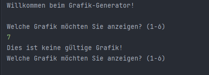
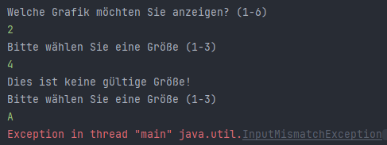
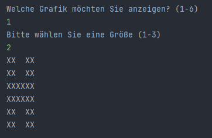
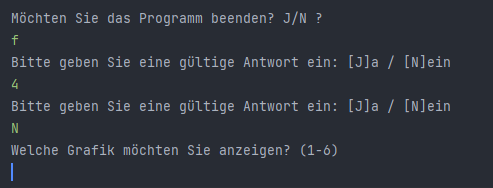
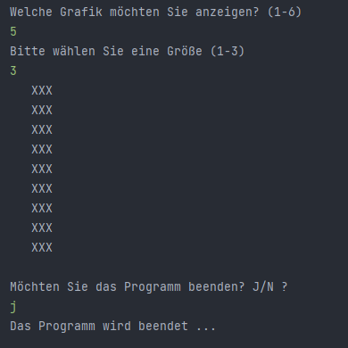

= *Grafik-Generator*

[.lead]
Der Grafik-Generator bietet die Möglichkeit unterschiedliche grafische
Figuren anzuzeigen. Der User kann die Art und Größe der Figur festlegen.
Hierbei kann zwischen 6 Figuren und je 3 Größen gewählt werden.

[.underline]#Folgende Figuren stehen zur Auswahl:#

`1`  - Großbuchstabe H

`2`  - Großbuchstabe L

`3`  - Großbuchstabe O

`4`  - Großbuchstabe O (andere Version)

`5`  - Großbuchstabe I

`6`  - Subtraktions-Zeichen (Minus)

[.underline]#Folgende Größen stehen zur Auswahl:#

`1` - Klein

`2` - Mittel

`3` - Groß

[%hardbreaks]
Zu Beginn wird der User nach der Grafik gefragt, die er anzeigen lassen möchte. Hier muss eine Zahl zwischen 1 und 6 eingegeben werden. Wird eine andere Zahl eingegeben, erfolgt ein Hinweis darauf, dass dies keine gültige Eingabe ist und fragt erneut nach der gewünschten Grafik. Dieser Vorgang wird so lange wiederholt, bis eine gültige Zahl eingegeben wird.
Wird stattdessen ein Buchstabe oder ein anderes Symbol eingegeben, stürzt das Programm ab, da diese Exception nicht vom Programm abgefangen wird.

[%hardbreaks]
Wurde eine Grafik ausgewählt, wird der User anschließend
nach einer Größe gefragt. Der Vorgang wird auch solange wiederholt bis eine Ziffer zwischen 1 und 3 eingegeben wird. Hier können ebenfalls nur Ziffern und keine Buchstaben oder andere Zeichen eingegeben werden, da die Exception vom Programm nicht abgefangen wird.

Bei korrekter Eingabe wird die entsprechende Grafik in der gewählten Größe angezeigt. Beispiel mit Eingabe 1 - 2:

_Hier wird dem User der Buchstabe H in Größe 2 (mittel) angezeigt._

[%hardbreaks]
Nach jeder Ausgabe wird der User gefragt, ob er das Programm beenden möchte. Hier muss mit Ja oder Nein geantwortet werden, wobei für Ja der Buchstabe 'J' und für Nein der Buchstabe 'N' eingegeben werden muss. Auf Groß-/Kleinschreibung muss dabei nicht geachtet werden, da diese bei der Abfrage ignoriert wird. Wird ein anderes Zeichen eingegeben, wird der User so lange gebeten eine gültige Antwort einzugeben, bis dies zutrifft.

[%hardbreaks]
Bei Eingabe 'N' wird das Programm wie gewohnt fortgesetzt. Der User kann wieder eine Grafik und eine entsprechende Größe wählen. Dieser Vorgang wird so lange wiederholt, bis der User das Programm mit Eingabe 'J' beenden möchte. In diesem Fall wird das Programm beendet und der User wird darauf hingewiesen.

#*API-Dokumentation*#

[%hardbreaks]
Bei Programmstart wird ein Scanner erstellt und die Datei `App` ausgeführt. Die Methode `Run`R, die eigentliche Game Loop, wird gestartet:

1.  Aufruf der Methode `initialize`: Der User wird zum Programm begrüßt. Mithilfe von `Thread.sleep` wird eine Verzögerung von 2 Sekunden bis zum nächsten Step erstellt.

2. Aufruf der Methode `printState`: Da das Objekt `figure` hier noch dem Wert 'null' entspricht, wird die Methode keine Figur ausgegeben. Anschließend wird in die while-Schleife gesprungen, die ausgeführt wird, solange die Variable `exit` den Wert "false" hat.

3. Aufruf der Methode `readUserInput`: Hier werden lediglich die beiden voneinander unabhängigen Methoden `inputFigure` und `inputSize` eingelesen. Beide enthalten eine do-while-Schleife, welche gewährleistet, dass das Programm erst bei gültiger Usereingabe (Zahl 1-6 oder Zahl 1-3) fortgesetzt wird. In beiden Methoden wird je eine Variable erstellt, die den Userinput als Wert  übernimmt -> `figureNr` und `figureSize`.
Wird kein Zahlenwert eingegeben, sondern ein anderes Zeichen, wie z.B. ein Buchstabe, dann wird das Programm abgebrochen, da dieser Fall vom Programm nicht abgefangen wird.

4. Aufruf der Methode `updateState`: Hier wird das Objekt `figure` mit der vom User gewählten Figur und Größe mittels eines switchs erstellt. Die Variable `figureSize` wird hierbei an das Objekt übergeben, da diese im Objekt selbst benötigt wird, um das Objekt in der entsprechenden Größe zu erstellen.

5. Aufruf der Methode `printState`: Da das Objekt nun einen Wert besitzt, wird es ausgegeben. Der User bekommt das gewünschte Objekt in Ascii-Code angezeigt.

6. Exit-Abfrage: der User wird gefragt, ob er das Programm beenden möchte. Der Input wird in die Variable `wantExit` eingelesen. Anschließend wird in einer while-Schleife die Gültigkeit der Eingabe geprüft. Ist die Eingabe ungültig, also weder 'J' oder 'j' noch 'N' oder 'n', so folgt eine entsprechende Ausgabe und erneute Aufforderung an den User. Bei gültiger Eingabe wird mit einer if-Abfrage geprüft, ob der Buchstabe 'J' eingegeben wurde. Ist dies der Fall, wird die Variable `exit` auf 'true' gesetzt. Hiermit wird die while-Schleife und damit der Game Loop beendet. Entspricht der Input nicht 'J', so muss er automatisch 'N' sein, daher bleibt der Wert der Variable `exit` unverändert und somit weiterhin 'false'. Der Game Loop wird fortgesetzt.

[%hardbreaks]
Wird der Game Loop beendet, springt das Programm zurück in die `Main` und ruft die Methode `input.close` auf. Es kann keine Eingabe vom User mehr erfolgen. Das Programm ist beendet und abschließend wird noch eine entsprechende Meldung ausgegeben.

[.underline]#Superklasse Figure#

Die einzelnen Figuren werden in den entsprechenden Klassen generiert, die alle von der Superklasse `Figure` erben. Die Klasse enthält ein bereits initialisiertes, zweidimensionales Array `symbol`, welches aus einem 3x3 Feld besteht. Es kann also pro Zeile und Spalte je 3 Zeichen des Typs `char` speichern.
Ebenso enthält die Klasse das Attribut `size`, welches die Größe der Figur als Wert übernehmen kann. Dieses wird über die Usereingabe konfiguriert, welche zuvor in der Variable `figureSize` gespeichert wird. Über den Konstruktor wird also nur die Größe erstellt. Dieser kann von den Unterklassen aufgerufen werden.

Weiters enthält die Klasse die `toString` Methode, welche von den Unterklassen überschrieben werden kann. #ERKLÄRUNG!!!#

[.underline]#Unterklassen#

Folgende Unterklassen werden im Programm verwendet:

--  FigureH

--  FigureI

--  FigureL

--  FigureMinus

--  FigureO

--  FigureO2

[%hardbreaks]
Alle Unterklassen erben das Array `symbol` der Superklasse und greifen über den Konstruktor `super(size)` auf den Superkonstruktor zu, durch den die Variable `size` erstellt wird. Im klasseneigenen Konstruktor wird außerdem das geerbte Array `symbol` mit dem jeweiligen Figuren-Muster befüllt. Der jeweilige Index wird mit dem `char` Wert 'X' befüllt.
