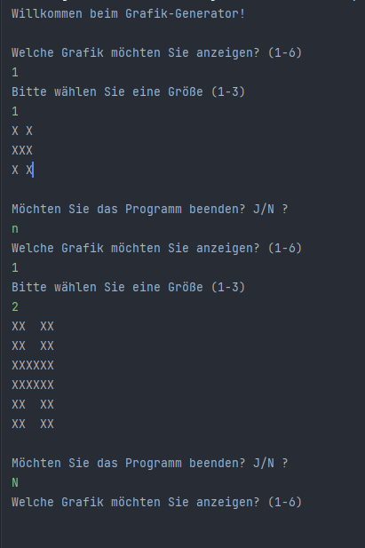
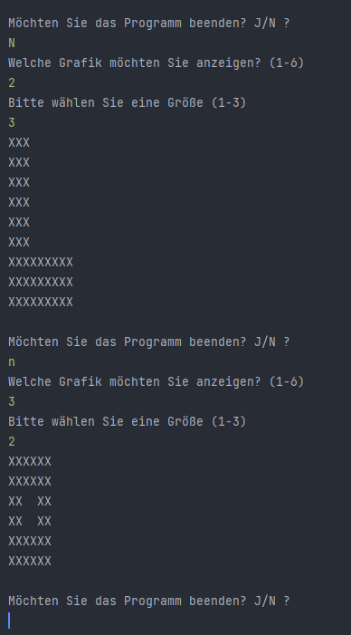
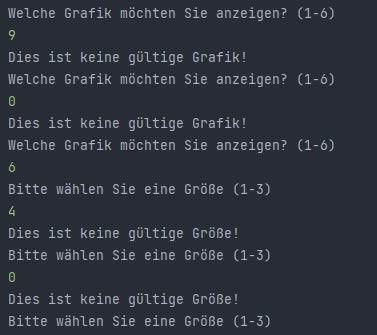
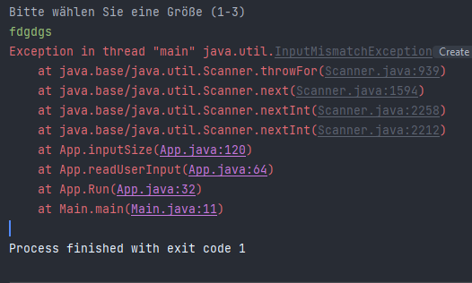
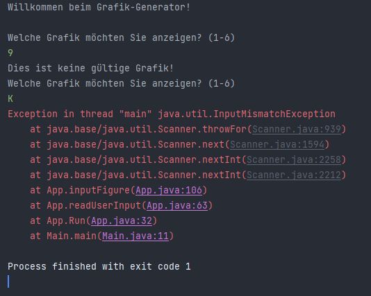
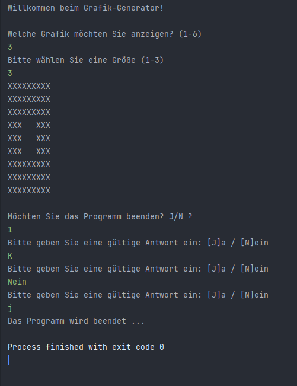

= Testfälle

__Die Grafik Nr.1 wird in den Größe 1 und 2 ausgegeben. Nach jeder Ausgabe wird der User gefragt, ob er das Programm beenden möchte. Antwort in Groß- und Kleinbuchstaben möglich. __

---

__ Grafik Nr. 2 in Größe 3 und Grafik Nr. 3 in Größe 2 werden ausgegeben. __

---

__ Ausgabe bei ungültiger User-Eingabe: Die Zahlen 0 und 9 liegen außerhalb des gültigen Rahmens für die Grafikauswahl. Die Zahlen 4 und 0 liegen außerhalb des Rahmens für die Größenauswahl. __

---

__ Wird bei der Größenabfrage ein anderes Zeichen als eine Ziffer eingegeben, wie in diesem Fall eine Buchstabenfolge, wird das Programm abgebrochen. Die Exception wird nicht vom Programm abgefangen. __

---

__ Wird bei der Grafikabfrage eine Zahl größer 6 eingegeben, wird dies abgefangen und ein entsprechender Hinweis ausgegeben. Ander verhält es sich bei der Eingabe von Buchstaben: das Programm abgebrochen, da die Exception nicht abgefangen wird. __

---

__ Die Grafik 3 in Größe 3 wird ausgegeben. __
__ Der User wird gefragt, ob das Programm beendet werden soll. Dreimal erfolgt eine ungültige Eingabe in Form einer Ziffer, eines Buchstabens und in Form des ausgeschriebenen Worts. Jede mögliche Falscheingabe wird abgefangen und der User wird erneut aufgefordert einen gültigen Wert einzugeben. Nach gültiger Eingabe wird das Programm mit entsprechender Ankündigung beendet.__

